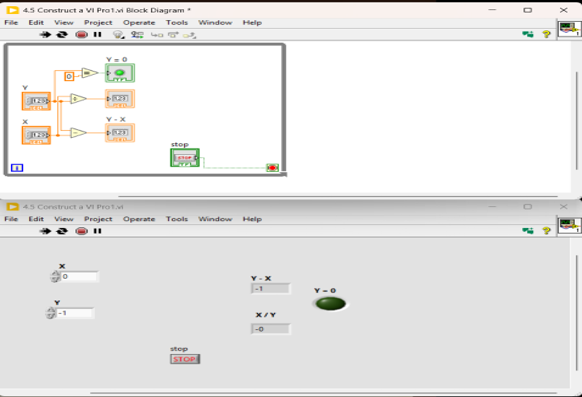
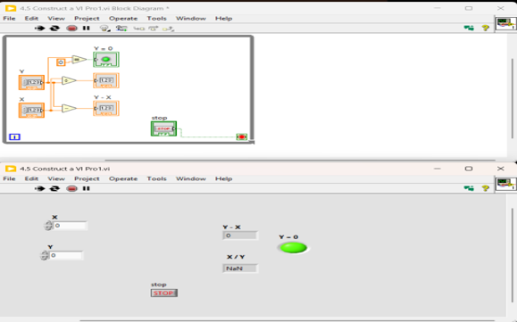
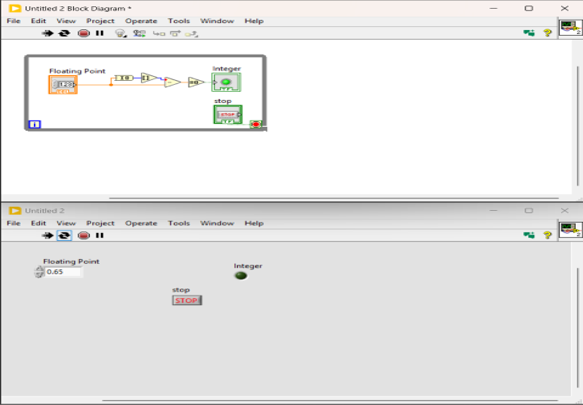
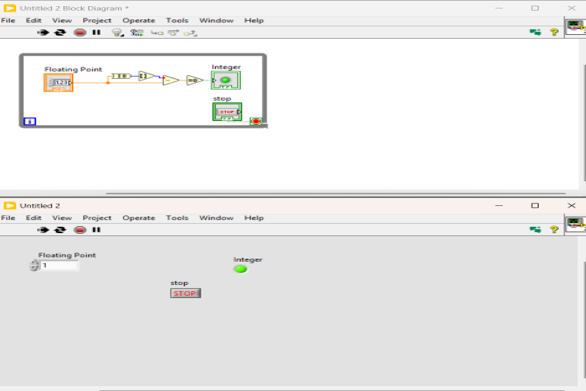
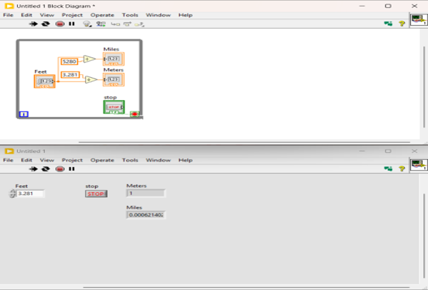
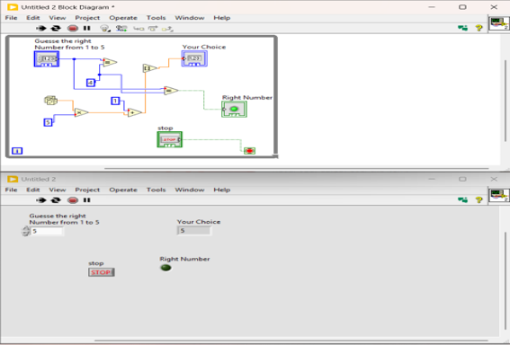
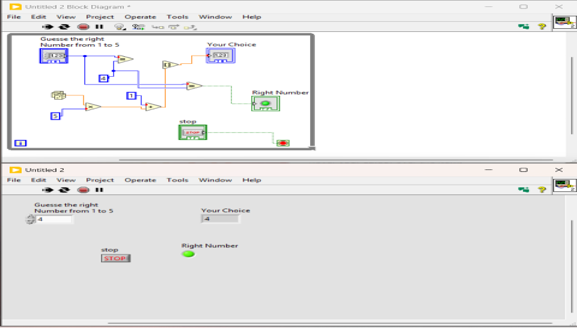

# Project 003 – LabVIEW Screenshots

## Overview

This folder contains screenshots documenting the Front Panels and Block Diagrams developed for Project 003.

The screenshots provide visual documentation of the four Virtual Instruments and demonstrate their graphical programming structure, inputs, outputs, calculations, and Boolean logic.

---

# Problem 1 – Floating-Point Calculations and Division-by-Zero Detection

## Screenshot 1

### File

`VI_Pro1_1.png`

### Description

This screenshot documents the Problem 1 Virtual Instrument.

The VI accepts floating-point inputs X and Y, performs subtraction and division, and evaluates whether Y equals zero.

The Block Diagram also demonstrates the use of a While Loop and Boolean logic for the division-by-zero indicator.

---

## Screenshot 2

### File

`VI_Pro1_2.png`

### Description

This screenshot provides additional documentation of the Problem 1 VI under a different test condition.

Together, the Problem 1 screenshots demonstrate the numerical calculations and conditional division-by-zero logic implemented in the Virtual Instrument.

---

# Problem 2 – Integer Detection

## Screenshot 1

### File

`VI_Pro2_1.png`

### Description

This screenshot shows the Front Panel and Block Diagram for the integer-detection Virtual Instrument.

The VI evaluates a floating-point input and uses a Boolean LED labeled **Integer** to indicate the result.

---

## Screenshot 2

### File

`VI_Pro2_2.png`

### Description

This screenshot demonstrates the integer-detection VI using another input condition.

The screenshots together demonstrate how the program responds to different floating-point values and controls the Integer Boolean indicator.

---

# Problem 3 – Feet-to-Meters and Miles Conversion

## Screenshot

### File

`VI_Pro3.png`

### Description

This screenshot shows the Front Panel and Block Diagram for the feet conversion Virtual Instrument.

The VI accepts a value in feet and calculates its equivalent in:

- Meters
- Miles

### Conversion Process

1. Read the feet input.
2. Divide the value by 3.281 to calculate meters.
3. Divide the value by 5280 to calculate miles.
4. Display both results on the Front Panel.
5. Continue operation inside the While Loop until the stop control is activated.

---

# Problem 4 – Random Number Guessing Game

## Screenshot 1

### File

`VI_Pro4_1.png`

### Description

This screenshot shows the Front Panel and Block Diagram for the random number guessing application.

The VI generates a number within the required range, compares it with the user's choice, and uses the **Right Number** Boolean LED to indicate the comparison result.

---

## Screenshot 2

### File

`VI_Pro4_2.png`

### Description

This screenshot demonstrates another operating condition of the random number guessing VI.

Together, the two screenshots show how the VI responds to different generated numbers and user choices.

---

# Screenshot Summary

| Screenshot | Problem | Demonstrated Function |
|---|---|---|
| `VI_Pro1_1.png` | Problem 1 | Floating-point calculations and division-by-zero logic |
| `VI_Pro1_2.png` | Problem 1 | Additional Problem 1 test condition |
| `VI_Pro2_1.png` | Problem 2 | Integer detection |
| `VI_Pro2_2.png` | Problem 2 | Additional integer-detection test condition |
| `VI_Pro3.png` | Problem 3 | Feet-to-meters and miles conversion |
| `VI_Pro4_1.png` | Problem 4 | Random number guessing and comparison |
| `VI_Pro4_2.png` | Problem 4 | Additional guessing-game test condition |

---

# Related Project Files

Return to the main project documentation:

[Project 003 Main README](../README.md)

View the original LabVIEW source files:

[Project 003 LabVIEW Files](../LabVIEW/)

View the laboratory report:

[Project 003 Lab Report](../Lab-Report.pdf)

---

# Purpose of the Screenshots

These screenshots provide visual evidence of the LabVIEW development and testing process.

Together, they demonstrate:

- Front Panel design
- Block Diagram programming
- Numerical calculations
- Floating-point data processing
- Unit conversion
- Boolean logic
- Conditional operations
- Random number generation
- Numerical comparison
- While Loop implementation
- Testing with different input conditions

The screenshots complement the original LabVIEW `.vi` source files and laboratory report included in Project 003.
