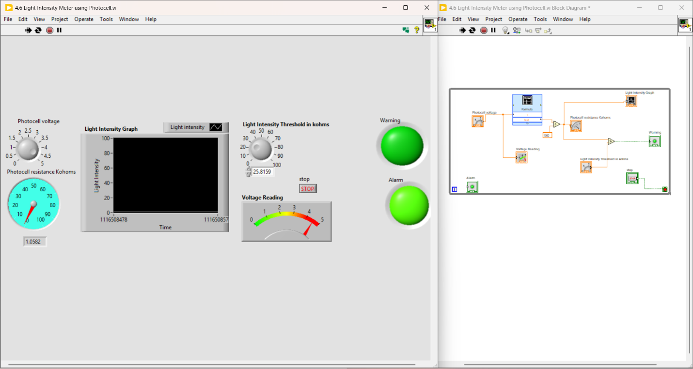
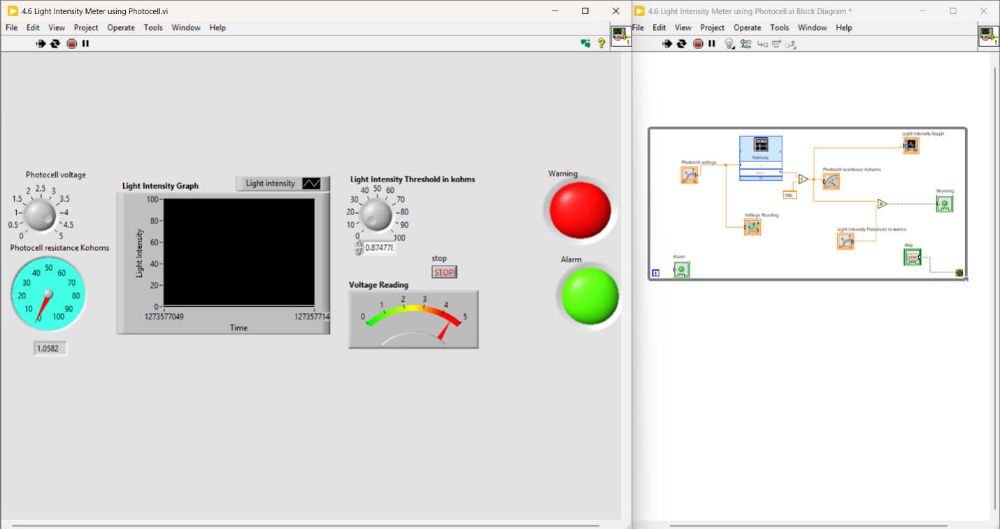
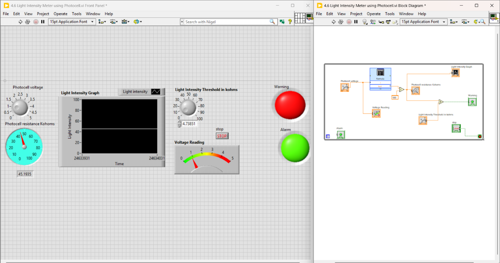
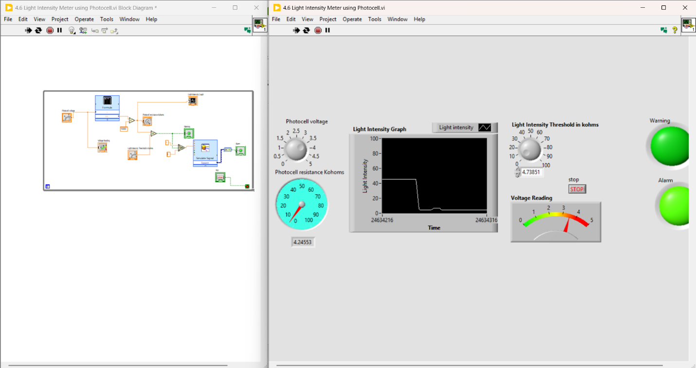
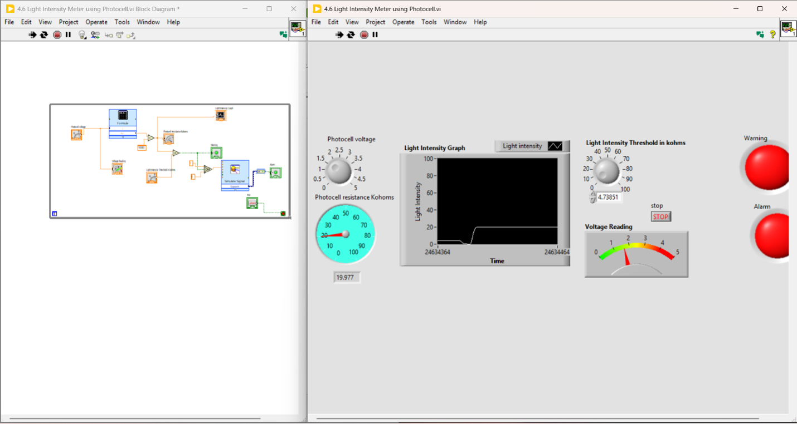

# Project 004 – LabVIEW Light Intensity Monitoring Using a Photocell

## Project Overview

This project focuses on the development of a LabVIEW Virtual Instrument (VI) used to monitor and analyze light intensity.

The system was designed to acquire and display light-related data using numeric, graphical, and Boolean indicators. User-defined limits were incorporated so that visual indicators could respond when the measured light intensity was within or outside a specified range.

The project also explored the electrical behavior of a photocell and the relationship between photocell resistance, light intensity, and voltage in a voltage-divider circuit.

Express VIs were used to simplify portions of the development process and reduce programming time.

---

## Project Objectives

The objectives of this project were to:

- Build a LabVIEW VI to monitor light intensity.
- Develop a user interface using numeric indicators.
- Use graphical indicators to visualize changing values.
- Implement Boolean indicators for light-intensity conditions.
- Use user-defined limits for monitoring light intensity.
- Apply Express VIs to simplify program development.
- Analyze photocell resistance as light intensity changes.
- Apply the voltage-divider relationship.
- Model voltage and resistance relationships.
- Generate simulated test signals.
- Observe and validate system behavior.

---

## Software Used

- National Instruments LabVIEW

---

# Photocell Fundamentals

## What Is a Photocell?

A photocell is a light-sensitive electronic device whose electrical characteristics change when exposed to different levels of light.

In the context of this project, the photocell acts as a variable resistance that changes according to the amount of light falling on it.

---

## Photocell Resistance and Light Intensity

The photocell demonstrates an inverse relationship between light intensity and resistance.

- As light intensity **increases**, photocell resistance **decreases**.
- As light intensity **decreases**, photocell resistance **increases**.

This behavior allows the photocell to be used as a sensing element in light-monitoring systems.

---

## Example Photocell Applications

Photocells can be used in applications such as:

- Light sensors
- Camera systems
- Automatic lighting systems
- Light measurement equipment
- Solar-related sensing applications

---

# Voltage Divider Analysis

The project examined the relationship between photocell resistance and output voltage using a voltage-divider circuit.

As the resistance of the photocell changes, the voltage measured across the resistor also changes.

The laboratory results demonstrated the following relationship:

| Photocell Resistance | Measured/Calculated Voltage |
|---:|---:|
| 150 Ω | 4.926 V |
| 1 kΩ | 4.545 V |
| 5 kΩ | 3.333 V |
| 6.5 kΩ | 3.03 V |
| 10 kΩ | 2.5 V |
| 1 MΩ | 0.05 V |

### Observed Behavior

As darkness increased:

1. Photocell resistance increased.
2. The voltage across the monitored resistor decreased.
3. The changing voltage could be used to represent changing light intensity.

---

# LabVIEW Development Process

The VI was developed using a structured engineering and programming process.

## Step 1 – Review the System Requirements

The project requirements were reviewed to identify:

- Required sensor behavior
- Numeric indicators
- Graphical indicators
- Boolean indicators
- User-defined limits
- Required calculations
- Signal simulation requirements

---

## Step 2 – Analyze the Photocell

The electrical behavior of the photocell was reviewed before implementing the LabVIEW system.

The key relationship identified was:

**More Light → Lower Resistance**

**Less Light → Higher Resistance**

Understanding this relationship was important for interpreting the measured voltage.

---

## Step 3 – Analyze the Voltage Divider

The photocell was treated as part of a voltage-divider circuit.

Different photocell resistance values were evaluated to determine the resulting voltage.

This established the relationship between:

- Light intensity
- Photocell resistance
- Output voltage

---

## Step 4 – Build the Front Panel

The LabVIEW Front Panel was developed to provide a clear visual interface for monitoring the system.

The interface included combinations of:

- Numeric indicators
- Graphical indicators
- Boolean indicators
- User-adjustable controls

The goal was to allow the user to quickly observe changes in the measured light-intensity signal.

---

## Step 5 – Build the Block Diagram

The LabVIEW Block Diagram was developed to process the input data and connect the required functions.

The graphical program was responsible for:

- Processing light-intensity-related values
- Performing required calculations
- Updating indicators
- Evaluating user-defined limits
- Controlling Boolean indicators

---

## Step 6 – Implement User-Defined Limits

The VI incorporated logic that compares the monitored light-intensity value with limits specified by the user.

Boolean indicators provide visual feedback depending on whether the measured value falls within or outside the required range.

This demonstrates the use of comparison and conditional logic in LabVIEW.

---

## Step 7 – Use Express VIs

Express VIs were incorporated to simplify portions of the program development.

Using Express VIs helped reduce the amount of manual graphical programming required while allowing the system to be configured and tested efficiently.

---

## Step 8 – Implement Mathematical Modeling

The project incorporated mathematical relationships between:

- Resistance
- Voltage
- Light intensity

LabVIEW mathematical functions were used to model and process the electrical relationships involved in the photocell circuit.

---

## Step 9 – Generate a Simulated Signal

A **Simulate Signal Express VI** was used to generate a sine-wave test signal.

The simulated signal provided a controlled input that could be used to observe and validate the behavior of the monitoring system.

---

## Step 10 – Display the Signal

Graphical indicators were used to display changing signal values.

This allowed variations in the simulated or monitored signal to be observed visually over time.

---

## Step 11 – Test the VI

The completed VI was tested to verify:

- Numeric display behavior
- Graphical signal display
- Boolean indicator operation
- User-defined threshold behavior
- Mathematical calculations
- Simulated signal operation

---

## Step 12 – Verify the Results

The system behavior was evaluated to confirm that changes in photocell resistance produced corresponding changes in output voltage.

The VI was also checked to ensure the graphical and Boolean indicators responded according to the implemented logic.

---

# Project Results

The project demonstrated the successful use of LabVIEW for monitoring and analyzing a light-sensitive system.

Key results included:

- Monitoring light-related values.
- Displaying data numerically.
- Displaying changing data graphically.
- Using Boolean indicators for condition monitoring.
- Applying user-defined limits.
- Modeling voltage-resistance relationships.
- Using Express VIs for rapid development.
- Generating simulated sine-wave signals for testing.
- Demonstrating the relationship between photocell resistance and light intensity.

---

# Skills Demonstrated

## LabVIEW Skills

- National Instruments LabVIEW
- Virtual Instrument Development
- Front Panel Design
- Block Diagram Development
- Numeric Indicators
- Graphical Indicators
- Boolean Indicators
- Express VIs
- Simulate Signal Express VI
- Comparison Logic
- Conditional Logic
- Mathematical Functions
- Signal Visualization
- Testing and Validation

## Electronics Skills

- Photocell Operation
- Light-Sensing Principles
- Resistance Analysis
- Voltage Divider Analysis
- Voltage Measurement
- Sensor Behavior
- Electrical Data Interpretation

## Engineering Skills

- System Analysis
- Mathematical Modeling
- Problem Solving
- Data Interpretation
- Signal Analysis
- Testing
- Troubleshooting
- Technical Documentation
- Attention to Detail

---

# Project Files

## LabVIEW Source File

The original LabVIEW Virtual Instrument developed for this project is located in the `LabVIEW` folder.

[Open LabVIEW Source Files](LabVIEW/)

Direct source file:

[Open Light Intensity Meter VI](LabVIEW/4_6%20Light%20Intensity%20Meter%20using%20Photocell.vi)

---

## Project Screenshots

The project screenshots are located in the `Screenshots` folder.

[View Project Screenshots](Screenshots/)

### Screenshot Gallery

---

# What I Learned

This project strengthened my understanding of how LabVIEW can be used to monitor and analyze physical sensor behavior.

I gained practical experience connecting electronics concepts such as photocell resistance and voltage-divider behavior with graphical programming techniques in LabVIEW.

The project also strengthened my understanding of numeric, graphical, and Boolean indicators, conditional monitoring, user-defined thresholds, Express VIs, simulated signals, mathematical modeling, and system testing.

Most importantly, the project demonstrated how a physical measurement such as light intensity can be translated into electrical values, processed by software, and presented through a user-friendly monitoring interface.

---

# Conclusion

Project 004 demonstrated the integration of sensor principles, electronics calculations, and LabVIEW graphical programming.

The results showed that increasing darkness causes photocell resistance to increase, which affects the voltage produced by the voltage-divider circuit.

LabVIEW was used to process and visualize these relationships through numeric, graphical, and Boolean indicators.

The use of Express VIs and simulated signals also demonstrated techniques for simplifying development and validating system behavior before or alongside physical measurements.

---

# Reference

*Light Sensors – Electronics Tutorials*

https://www.electronics-tutorials.ws/io/io_4.html
