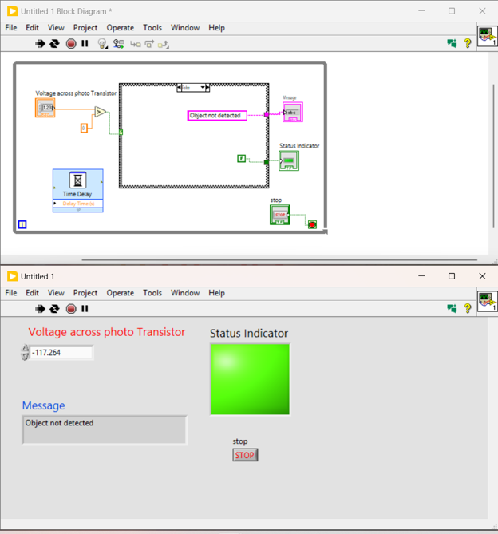
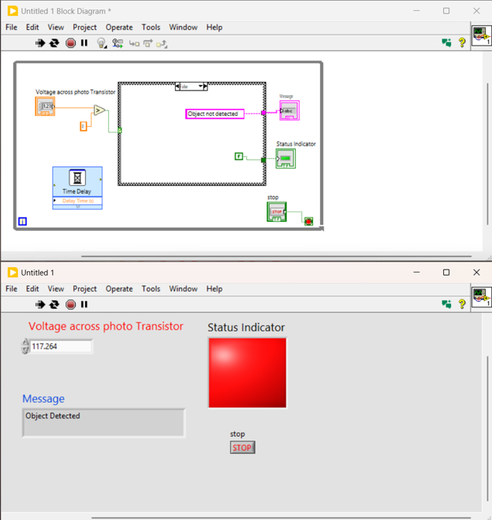

# Project 005 – Infrared Proximity Detection Using Multisim and LabVIEW

## Project Overview

This project demonstrates the design and simulation of an **infrared (IR) proximity detection system** using National Instruments Multisim and LabVIEW.

The project combines electronic circuit simulation with graphical programming to create a basic object-detection and monitoring system.

Multisim was used to simulate an infrared transmitter and receiver using a photodiode and phototransistor. The voltage behavior of the phototransistor was then used in LabVIEW to develop a Virtual Instrument (VI) that determines whether an object is obstructing the simulated light path.

The LabVIEW application evaluates the phototransistor voltage against a **3.5 V threshold** and provides two forms of visual feedback:

- A text message indicating **Object Detected** or **Object not detected**
- A Boolean **Status Indicator** that changes state according to the detection condition

This project demonstrates the integration of electronics simulation, sensor behavior, measurement, conditional logic, and virtual instrumentation.

---

## Project Objectives

The objectives of this project were to:

- Build and test an infrared transmitter and receiver circuit in Multisim.
- Understand the operation of a photodiode and phototransistor.
- Simulate interruption of an infrared light path.
- Measure voltage across the phototransistor.
- Use Multisim measurements as input conditions for LabVIEW testing.
- Develop a LabVIEW Virtual Instrument for proximity detection.
- Implement a 3.5 V detection threshold.
- Use comparison logic to evaluate sensor voltage.
- Implement a LabVIEW Case Structure.
- Display object-detection messages.
- Control a Boolean status indicator.
- Use a While Loop for continuous program operation.
- Add a Time Delay to control loop execution.
- Test the VI under multiple simulated sensor conditions.

---

## Software Used

- National Instruments Multisim
- National Instruments LabVIEW

---

# System Concept

The proximity detection system is based on an optical transmitter and receiver.

The simulated sensing arrangement consists of:

**Photodiode / IR Source → Light Path → Phototransistor → Detection Circuit**

Under normal conditions, the light produced by the transmitter reaches the phototransistor.

When an object interrupts the light path, the electrical behavior of the receiver circuit changes.

This change can be observed through the voltage across the phototransistor.

The measured voltage is then evaluated in LabVIEW to determine the detection state.

---

# Multisim Circuit Simulation

## Step 1 – Build the Infrared Transmitter and Receiver

The first stage of the project was completed in Multisim.

The circuit was constructed using a photodiode and phototransistor arranged to simulate an optical transmitter and receiver.

The components were positioned so that the simulated light produced by the transmitting device could interact with the phototransistor.

---

## Step 2 – Control the Light Source

Switch **S1** was used to control the transmitter side of the simulated circuit.

### Light Path Available

When S1 is closed:

1. The transmitting circuit is active.
2. Light reaches the phototransistor.
3. The phototransistor conducts.
4. The receiver circuit responds accordingly.

### Light Path Interrupted

Opening S1 simulates an object interrupting the optical path.

Under this condition:

1. The transmitting condition changes.
2. The phototransistor no longer receives the simulated light.
3. Its electrical behavior changes.
4. The receiver circuit responds to the obstruction.

This models the basic operating principle of an optical proximity or beam-interruption detector.

---

# Voltage Measurement

A digital multimeter (DMM) was used in Multisim to observe the voltage associated with the phototransistor circuit.

Measurements were collected under different simulated operating conditions.

These measurements provided the data needed to determine an appropriate detection threshold for the LabVIEW application.

A threshold of:

**3.5 V**

was selected for the VI.

---

# LabVIEW Virtual Instrument

After analyzing the simulated circuit behavior, a LabVIEW Virtual Instrument was developed to process the phototransistor voltage.

The Front Panel contains:

- **Voltage across photo Transistor** numeric control
- **Message** text indicator
- **Status Indicator**
- **Stop** control

The VI provides a simple monitoring interface that translates a sensor-related voltage into an easily understood detection status.

---

# LabVIEW Development Process

## Step 1 – Create the Voltage Input

A Numeric Control was added to the Front Panel and labeled:

**Voltage across photo Transistor**

This control represents the measured phototransistor voltage obtained from the Multisim simulation.

---

## Step 2 – Create the Message Indicator

A Text Indicator labeled:

**Message**

was added to provide a human-readable detection result.

Depending on the evaluated voltage, the VI displays either:

**Object Detected**

or:

**Object not detected**

---

## Step 3 – Create the Status Indicator

A square Boolean indicator labeled:

**Status Indicator**

was added to the Front Panel.

The indicator was configured to visually distinguish the detection states.

According to the lab design:

- **RED / ON** → Object detected
- **GREEN / OFF** → Object not detected

This provides immediate visual feedback in addition to the text message.

---

## Step 4 – Add Continuous Program Execution

A **While Loop** was placed around the LabVIEW processing logic.

The While Loop allows the VI to continue evaluating the input voltage until the user presses the Stop control.

This structure demonstrates continuous monitoring behavior commonly used in instrumentation and automation applications.

---

## Step 5 – Add a Time Delay

A Time Delay function was incorporated into the loop.

The laboratory specified a delay of:

**0.1 seconds**

The delay helps control loop execution and reduces unnecessary CPU utilization.

---

## Step 6 – Implement the Detection Threshold

The phototransistor voltage is compared with a threshold of:

**3.5 V**

The comparison produces a Boolean result that controls the Case Structure.

Conceptually:

```text
Phototransistor Voltage
          |
          v
   Compare with 3.5 V
          |
          v
     Boolean Result
          |
          v
      Case Structure
       /          \
    TRUE          FALSE
      |              |
      v              v
 Detection       No Detection
```

---

## Step 7 – Implement the Case Structure

A LabVIEW **Case Structure** was used to create two possible program responses.

The executed case depends on the result of the voltage comparison.

The Case Structure controls:

- Detection message
- Status Indicator state

This converts the measured numerical voltage into a logical detection decision.

---

# Detection Logic

The project uses the following decision structure:

```text
Sensor-Related Voltage
        |
        v
Compare to 3.5 V Threshold
        |
        v
   Case Structure
     /       \
Detected    Not Detected
   |             |
   v             v
Message       Message
   +             +
Status        Status
Indicator     Indicator
```

The screenshots demonstrate both detection states during testing.

---

# Testing and Validation

The completed LabVIEW VI was tested using different phototransistor voltage values based on the Multisim circuit behavior.

Testing included:

1. Entering different voltage values.
2. Comparing each value with the 3.5 V threshold.
3. Observing the Message indicator.
4. Observing the Status Indicator.
5. Testing both detected and non-detected states.
6. Repeating the tests to verify consistent operation.
7. Confirming continuous execution through the While Loop.
8. Stopping the VI using the Stop control.

---

# Demonstrated Operating Conditions

## Object Not Detected

The screenshots demonstrate non-detection conditions where the Front Panel displays:

**Object not detected**

and the Status Indicator is shown in its **green** state.



---

## Object Detected

The screenshots also demonstrate detection conditions where the Front Panel displays:

**Object Detected**

and the Status Indicator changes to **red**.



---

# Project Workflow

The complete engineering workflow for this project was:

```text
Define Detection Requirement
            |
            v
Build IR Circuit in Multisim
            |
            v
Simulate Light / Obstruction Conditions
            |
            v
Measure Phototransistor Voltage
            |
            v
Determine Detection Threshold
            |
            v
Develop LabVIEW Front Panel
            |
            v
Develop LabVIEW Block Diagram
            |
            v
Implement 3.5 V Comparison
            |
            v
Implement Case Structure
            |
            v
Display Message + Status
            |
            v
Test Multiple Conditions
            |
            v
Verify System Behavior
```

---

# Project Results

The project successfully demonstrated the integration of circuit simulation and graphical programming for proximity detection.

Multisim was used to model the optical sensing circuit and evaluate its voltage behavior.

LabVIEW was then used to convert the sensor-related voltage into a logical detection state using:

- Numerical input
- Voltage comparison
- 3.5 V threshold
- Boolean logic
- Case Structure
- Text messages
- Status indication
- Continuous While Loop execution

The completed VI successfully demonstrated different responses for object-detected and object-not-detected test conditions.

---

# Skills Demonstrated

## LabVIEW

- Virtual Instrument Development
- Front Panel Design
- Block Diagram Programming
- Numeric Controls
- String Indicators
- Boolean Indicators
- Comparison Functions
- Boolean Logic
- Case Structures
- While Loops
- Timing Functions
- Conditional Processing
- Testing and Validation
- Troubleshooting

## Multisim

- Electronic Circuit Simulation
- Photodiode / Optical Source Simulation
- Phototransistor Operation
- Infrared Sensing Concepts
- Circuit Testing
- Digital Multimeter Measurements
- Voltage Analysis
- Sensor Circuit Simulation

## Electronics and Instrumentation

- Optical Sensing
- Infrared Proximity Detection
- Phototransistor Behavior
- Voltage Measurement
- Threshold Detection
- Sensor Signal Interpretation
- Electronic Measurement
- Instrumentation Concepts

## Engineering

- System Design
- Circuit Analysis
- Data Interpretation
- Hardware/Software Integration Concepts
- Logical Decision Making
- Problem Solving
- Testing and Validation
- Troubleshooting
- Technical Documentation

---

# Project Files

## LabVIEW Source

The original LabVIEW Virtual Instrument is located in the `LabVIEW` folder.

[View LabVIEW Files](LabVIEW/)

[Open Proximity Detection VI](LabVIEW/5_2%20Infrared%20Based%20Proximity%20Detection.vi)

---

## Multisim Source

The original Multisim circuit simulation is located in the `Multisim` folder.

[View Multisim Files](Multisim/)

[Open Multisim Circuit](Multisim/5_2%20Infrared%20Based%20Proximity%20Detection%20Using%20LabVIEW%C2%AE.ms14)

---

## Screenshots

The project screenshots are located in the `Screenshots` folder.

[View Project Screenshots](Screenshots/)

---

# What I Learned

This project strengthened my understanding of how electronic sensor behavior can be connected with software-based instrumentation and decision logic.

Using Multisim, I practiced building and testing an optical sensing circuit and analyzing how changes in the simulated light path affect the phototransistor circuit.

Using LabVIEW, I learned how numerical sensor data can be evaluated against a threshold and converted into useful operator information through Boolean indicators and text messages.

The project also strengthened my experience with Case Structures, While Loops, timing functions, comparison logic, Front Panel development, Block Diagram programming, testing, and troubleshooting.

Most importantly, this project demonstrated a complete workflow from **electronic circuit simulation and measurement to software-based monitoring and decision making**.

---

# Conclusion

Project 005 demonstrated an infrared-based proximity detection concept using Multisim and LabVIEW.

Multisim provided the electronic simulation environment for the optical transmitter/receiver system and voltage measurements, while LabVIEW provided the monitoring and decision-making interface.

By comparing the phototransistor voltage with a 3.5 V threshold, the VI was able to distinguish between detection conditions and provide both textual and visual status feedback.

The project demonstrates fundamental concepts used in sensing, instrumentation, automation, monitoring, and hardware/software integration.

---

# Reference

Laboratory instructions and requirements provided for the EET221L Instrumentation and Measurement Lab.

Additional reference used in the laboratory:

*Infrared Proximity Sensor Using Transistors – IR LED*, Circuits DIY.
