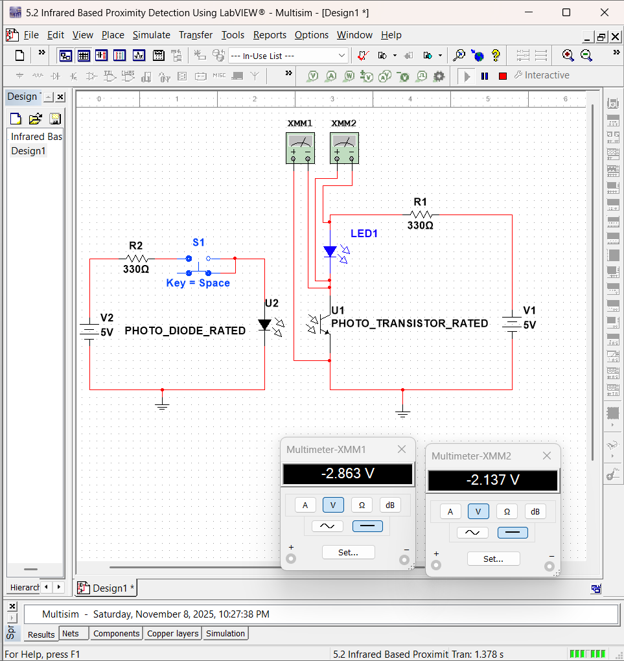
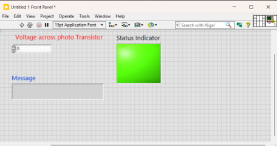
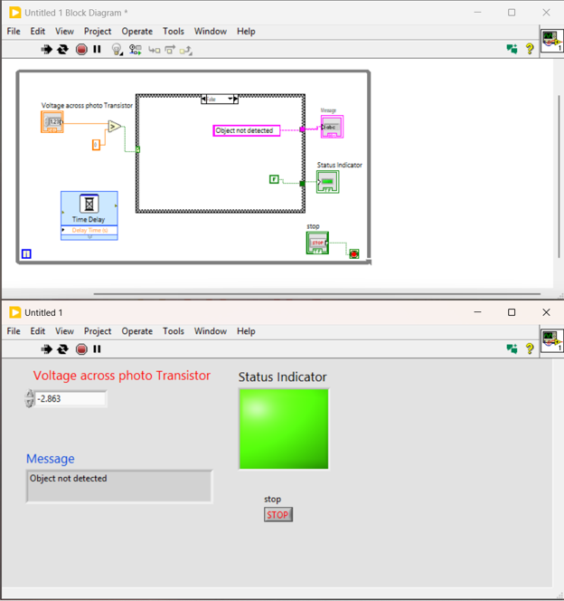
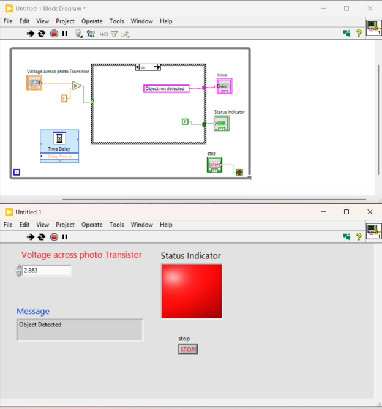

# Project 005 – Infrared Proximity Detection Screenshots

## Overview

This folder contains screenshots documenting the LabVIEW portion of the infrared proximity detection project.

The screenshots demonstrate the Front Panel, Block Diagram, detection logic, and multiple operating conditions of the completed Virtual Instrument.

# Screenshot 1 – Multisim Infrared Proximity Detection Circuit

## File

`Picture1.png`



## Description

This screenshot shows the Multisim circuit simulation used for the infrared proximity detection project.

The circuit includes:

- 5 V power sources
- 330 Ω resistors
- Switch S1
- Photodiode
- Phototransistor
- LED indicator
- Digital multimeters

The left side of the circuit represents the optical transmitter portion, while the right side represents the receiver portion using the phototransistor.

The digital multimeters were used to observe voltage behavior in the simulated receiver circuit under different sensing conditions.

### Development Process

1. Build the transmitter-side circuit.
2. Add the photodiode and switching element.
3. Build the phototransistor receiver circuit.
4. Add the LED status indicator.
5. Connect the 5 V supply sources.
6. Add digital multimeters for voltage measurement.
7. Run the Multisim simulation.
8. Change the optical/switching condition.
9. Observe the resulting voltage values.
10. Use the measured behavior to support the LabVIEW detection logic.

---

# Screenshot 1 – Front Panel Design

## File

`Picture2.png`



## Description

This screenshot shows the LabVIEW Front Panel interface used for the proximity detection application.

The interface contains:

- **Voltage across photo Transistor** numeric control
- **Message** text indicator
- **Status Indicator**

The Front Panel was designed to provide a simple operator interface for entering sensor-related voltage and observing the resulting detection state.

---

# Screenshot 2 – Object Detected

## File

`Picture3.png`


## Description

This screenshot shows the Block Diagram together with an **Object Detected** operating condition.

The Front Panel displays:

- Phototransistor-related voltage input
- `Object Detected` message
- Red Status Indicator
- Stop control

The Block Diagram shows the major program structures used to implement the detection logic, including:

- While Loop
- Voltage comparison
- Case Structure
- String output
- Boolean status output
- Time Delay
- Stop control

This screenshot demonstrates the detected state of the VI.

---

# Screenshot 3 – Object Not Detected

## File

`Picture4.png`


## Description

This screenshot demonstrates an **Object not detected** operating condition.

The Front Panel shows:

- A different voltage test value
- `Object not detected` message
- Green Status Indicator

The screenshot demonstrates that the Case Structure changes the displayed message and Boolean state according to the voltage comparison result.

---

# Screenshot 4 – Additional Non-Detection Test

## File

`Picture5.png`



## Description

This screenshot documents another test of the non-detection condition using a different input value.

The VI again displays:

**Object not detected**

and the Status Indicator remains green.

Testing multiple input values helps verify that the detection logic responds consistently across different operating conditions.

---

# Screenshot 5 – Additional Detection Test

## File

`Picture6.png`



## Description

This screenshot demonstrates another detected condition using a different voltage input.

The Front Panel displays:

**Object Detected**

and the Status Indicator changes to red.

This provides additional validation that the threshold comparison and Case Structure correctly control the detection output.

---

# Block Diagram Architecture

The screenshots document the primary LabVIEW program flow:

```text
Voltage across photo Transistor
             |
             v
       Comparison Logic
             |
             v
        Case Structure
          /       \
       TRUE       FALSE
         |           |
         v           v
      String       String
      Output       Output
         |           |
         +-----+-----+
               |
               v
        Status Indicator
```

The processing logic is contained within a **While Loop**, allowing continuous operation until the Stop control is activated.

A **Time Delay** is also included to control the loop execution rate.

---

# Screenshot Summary

| Screenshot | Demonstration |
|---|---|
| `Picture1.png` | Multisim infrared transmitter/receiver circuit and voltage measurement |
| `Picture2.png` | LabVIEW Front Panel design |
| `Picture3.png` | Object Detected state |
| `Picture4.png` | Object Not Detected state |
| `Picture5.png` | Additional non-detection test |
| `Picture6.png` | Additional detection test |

---

# Testing Demonstrated

The screenshots provide evidence of testing under multiple voltage conditions.

The testing process included:

1. Entering a phototransistor-related voltage.
2. Comparing the voltage with the configured threshold.
3. Observing the Case Structure response.
4. Checking the Message indicator.
5. Checking the Status Indicator.
6. Repeating the test using different voltage values.
7. Verifying both detection states.

---

# Skills Demonstrated

- LabVIEW Front Panel Design
- Block Diagram Programming
- Numerical Input Processing
- Comparison Logic
- Boolean Logic
- Case Structures
- String Indicators
- Boolean Indicators
- While Loops
- Time Delay
- Conditional Monitoring
- Testing and Validation
- Troubleshooting

---

# Related Project Files

Return to the main project:

[Project 005 Main README](../README.md)

View the LabVIEW source file:

[LabVIEW Source Files](../LabVIEW/)

View the Multisim circuit:

[Multisim Source Files](../Multisim/)

---

# Purpose of the Screenshots

These screenshots document the development and testing of the LabVIEW proximity detection application.

Together, they demonstrate the user interface, graphical program architecture, threshold-based decision logic, and multiple test conditions used to verify the Virtual Instrument.
